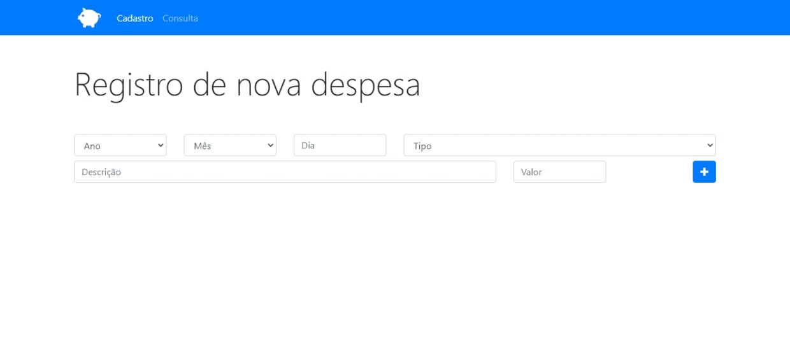
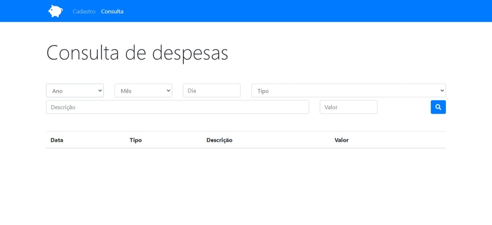
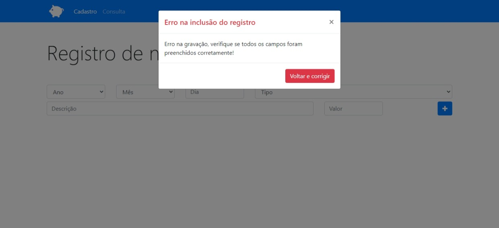
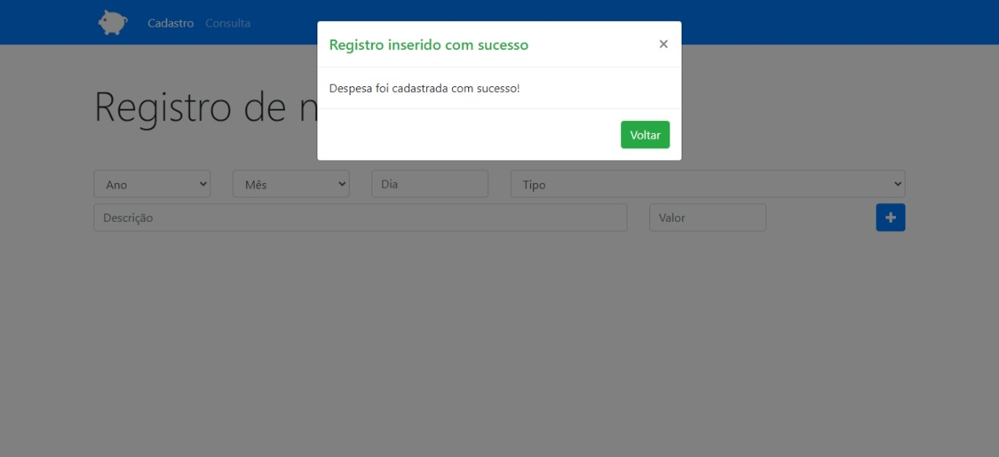
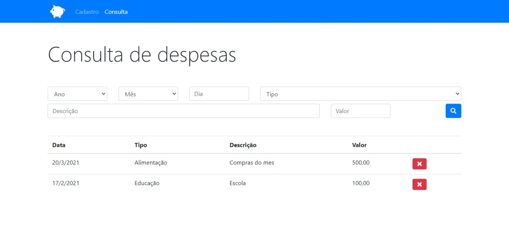

#App-Orçamento-pessoal

### **detalhes do App**
 
 Essa aplicação consiste em um App de despesas onde posso fazer cadastros de despesas e esses cadastros ficam Armazenados no próprio Storage do navegador onde no próprio Storage eu posso consultar e cadastrar Registros da Despesas Cadastradas Onde nessas Despesas poderei ver Elas Registadas em consultas e A partir dessa Consulta Eu Posso Filtrar e pesquisar aquela determinada despesa armazenada pelo usuário
 
 #imagens do projeto
 

## Link para testar o APP
<https://awesome-haibt-57608d.netlify.app>

#Tecnologias utilizadas

JavaScript
HTML
CSS

